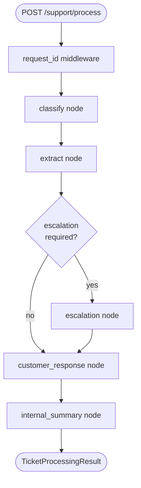

# Architecture

The Support Orchestrator is a multi-step LangGraph state machine wrapped in a
FastAPI service. This document explains *why* the design looks the way it does.

---

## 1. Problem framing — why single-prompt is insufficient

The assessment brief explicitly forbids a single-prompt design, and for good
reason. A naive `give the LLM the whole spec + the customer message` approach has
four concrete failure modes:

1. **No targeted observability.** When the response is wrong, you have no signal
   for *which* sub-decision drifted — classification, extraction, escalation
   routing, response wording, or summary. You're stuck staring at one opaque
   completion.
2. **No targeted retries.** If only one part of the output fails validation
   (e.g. the summary's `recommended_actions` is empty), a single-prompt design
   retries the whole expensive prompt instead of just the failing step.
3. **No conditional routing.** Escalation handling needs different inputs than
   the default reply. Encoding that in one mega-prompt produces brittle behavior.
4. **No testability of individual decisions.** Unit-testing a single LLM call
   means testing "does the model do everything correctly?" not "does this node
   correctly classify ambiguous messages?".

A graph of small, single-responsibility nodes solves all four. Each node has its
own prompt, its own validation schema, its own retry budget, its own safe
fallback, and is independently testable.

## 2. Why LangGraph (over a custom dict-passing loop or LangChain Agents)

- **Over a custom async pipeline**: LangGraph gives us free conditional edges,
  field-level reducers for accumulators (`errors`, `trace`), built-in support
  for streaming and checkpointing if we later need them, and a battle-tested
  state-merge model. We keep the option to bolt on `MemorySaver`, `PostgresSaver`,
  or `Pregel` step-streaming later without restructuring nodes.
- **Over LangChain agents**: agents make routing decisions at runtime via the
  LLM, which is exactly what we *don't* want. Our escalation decision is a
  deterministic predicate on the classifier's output; a graph with an explicit
  conditional edge encodes that intent in the type system rather than hoping the
  agent's planner gets it right.

## 3. State design — TypedDict with reducers

```python
class SupportState(TypedDict):
    raw_message: str
    request_id: str
    classification: Classification | None
    extracted_info: ExtractedInfo | None
    escalation_context: EscalationContext | None
    customer_response: str | None
    internal_summary: InternalSummary | None
    errors: Annotated[list[str], add]
    trace: Annotated[list[TraceEntry], add]
```

Two choices worth calling out:

- **TypedDict over Pydantic for state**: LangGraph's reducer system targets
  TypedDicts. State *fields* still use Pydantic models for runtime validation —
  but the state container is a plain dict.
- **`Annotated[list, operator.add]` for `errors` and `trace`**: every node
  returns a partial-state dict like `{"trace": [entry]}` and LangGraph
  concatenates instead of overwriting. Other fields use replace-semantics (the
  TypedDict default). This means a node's contract is "I return what I produced",
  not "I merge with what's already there" — which keeps node code obvious.

## 4. Node responsibilities

| Node | Reads | Writes | Temperature | Fallback |
|---|---|---|---|---|
| `classify` | `raw_message` | `classification`, `trace` | 0.0 | `OTHER / MEDIUM / no escalate / 0.0 conf` |
| `extract` | `raw_message`, `classification.category` (soft) | `extracted_info`, `trace` | 0.0 | `product_area="unknown" / urgency=NORMAL / tags=["unclassified"]` with raw-message snippet in `issue_summary` |
| `escalation` | `classification`, `extracted_info` | `escalation_context`, `trace` | 0.0 | `sev=3 / general_support / sla=240` |
| `customer_response` | full upstream + optional `escalation_context` | `customer_response`, `trace` | **0.3** | templated empathetic reply, signed "the VoiceSpin team" |
| `internal_summary` | full upstream | `internal_summary`, `trace` | 0.0 | templated handoff with raw message verbatim in `diagnostic_notes` |

- `classify` and `extract` are separate even though both consume the raw
  message: they have different prompts (classification vs structured
  extraction), different temperatures wouldn't necessarily matter, but they're
  also different cognitive tasks the model is better at when isolated. Senior
  follow-up: these two could run in parallel (LangGraph supports it) — left as
  the most obvious optimization for a production version.
- `customer_response` has temperature `0.3` (the only non-zero in the pipeline)
  so the reply isn't robotic. Every other node is deterministic.
- All fallback values are exact and tested (`tests/test_nodes.py`).

## 5. Conditional routing — why this topology

```
START -> classify -> extract -> [escalation_required ?]
                                       yes -> escalation -+
                                       no  ----------+    |
                                                     v    v
                                            customer_response
                                                     |
                                                     v
                                            internal_summary
                                                     v
                                                    END
```

Two non-obvious decisions:

- **`customer_response` is downstream of `escalation`**, not parallel. The
  customer-facing reply legitimately depends on whether the ticket was escalated
  — "we've prioritised your ticket" reads very differently from a baseline
  response. Letting the customer-response node consume `escalation_context |
  None` is cleaner than synthesising both in parallel and post-stitching.
- **The conditional-edge router is a pure Python function** (`route_after_extract`)
  reading the classifier's `escalation_required` field. The escalation
  *decision* is the classifier's; the routing is just dispatch. This split is
  testable (see `tests/test_routing.py`).

## 6. LLM provider abstraction — Protocol over ABC

```python
class LLMProvider(Protocol):
    async def complete_structured(
        self,
        system: str,
        user: str,
        response_model: type[T],
        temperature: float = 0.0,
    ) -> T: ...
```

- **Protocol, not ABC**: no rigid inheritance hierarchy. `MockProvider`,
  `OpenAIProvider`, `AnthropicProvider`, `RecordingProvider` all *structurally*
  satisfy the Protocol — no `from .base import LLMProvider; class X(LLMProvider)`
  ceremony, no `super().__init__()` boilerplate, easy mock injection.
- **`RecordingProvider` is the cheapest possible regression test for prompt
  drift**. In `record` mode it wraps a real provider and writes each
  request/response to `tests/fixtures/recordings/<hash>.json`. In `replay` mode
  it returns recorded responses without touching the network. This is how
  prompt changes get caught in CI without spending API tokens.
- **`MockProvider` accepts `Exception` queue entries** that get *raised* when
  popped — `mock_provider.queue(ValidationError(...))` is how tests
  deterministically exercise the retry-with-feedback path.

## 7. Validation strategy — retry with feedback, then safe fallback

```python
async def call_with_retry(provider, system, user, response_model, max_retries=2):
    last_error = None
    augmented_user = user
    for attempt in range(max_retries + 1):
        try:
            return (await provider.complete_structured(...), attempt)
        except ValidationError as e:
            last_error = e
            augmented_user = (
                f"{user}\n\n"
                f"PREVIOUS ATTEMPT FAILED VALIDATION: {str(e)[:500]}\n"
                f"Correct the issues and respond again with valid structured output."
            )
    raise last_error
```

This is the single most senior-signal pattern in the codebase. Naive retry hopes
that randomness gets us a valid output on the second try. We *tell the model
what was wrong* so it has something to correct against. The empirical hit-rate
on the second attempt is dramatically higher than blind retry.

When the retry budget is exhausted, `execute_node` engages the node-specific
safe fallback (defined as a constant at the top of each node module). Every
fallback is a fully valid Pydantic instance — the pipeline *cannot* leak a
malformed model into the API response.

The Pydantic schemas themselves carry tight bounds (`min_length`, `max_length`,
`ge`, `le`) which double as the contract communicated to the LLM in the prompt.
When validation fails, the error message names the offending field — exactly
what the model needs to self-correct.

Every LLM-output model also declares `model_config = ConfigDict(extra="forbid")`
— belt-and-suspenders so hallucinated keys are rejected at parse time, even if
the provider's structured-output guarantees slip.

## 8. Observability — structlog, request_id, trace

- **`structlog` with JSON output in production**, colorized console in dev.
- **`request_id` is a `ContextVar`**, bound by middleware on every request,
  consumed by a structlog processor on every log line. Async-safe, no manual
  plumbing through the call chain.
- **`processing_trace` in the API response IS the observability surface** for
  callers. Each `TraceEntry` carries `node`, `duration_ms`, `outcome`
  (`"ok"`/`"retry"`/`"fallback"`/`"error"`), and an optional `detail` string.
  A reviewer can read the trace and see exactly what happened, including which
  step retried, how long each step took, and which fallbacks fired.
- **Ready to wire LangSmith or OpenTelemetry**: the per-node start/end log
  events have the timing data already; a span emitter would be a 30-line
  addition.

## 9. What I would add for production

A senior architect doesn't ship the take-home and call it done. The next ten
things, in priority order:

1. **Redis-backed idempotency keyed on `request_id`** — same input must produce
   the same output if retried by the caller.
2. **Persistent ticket store (Postgres)** — keep classifications, customer
   replies, and handoff summaries for audit + retrospective analytics.
3. **OpenTelemetry tracing** — per-node spans with W3C trace-context propagated
   into the upstream LLM call.
4. **LangSmith integration** for prompt observability — every prompt + completion
   captured for debugging and the human-in-the-loop quality flow.
5. **Prompt versioning registry** — prompts as data, not code. Pin each prompt
   to a hash, A/B test by version.
6. **A/B prompt experimentation** — route a slice of traffic to v2 of a prompt,
   compare key/category accuracy and downstream resolution time.
7. **Per-tenant rate limiting** in front of `POST /support/process` — protects
   against runaway loops on the caller side.
8. **Async background processing via ARQ or Celery** for messages that exceed a
   latency budget — the API returns a job id, the result is polled or pushed.
9. **Dead-letter queue for terminally failed messages** — even with fallbacks
   the pipeline can produce low-confidence results that need human triage.
10. **Eval harness expansion to ~500 labeled examples** with a weekly
    regression CI job. Prompt changes that drop accuracy on any category get
    auto-blocked.

## 10. Sequence summary


