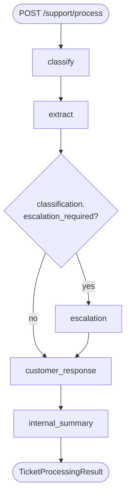

# Support Orchestrator

> Production-grade, multi-step AI orchestration for inbound support tickets.
> FastAPI + LangGraph 1.0 + Pydantic 2, with retry-with-feedback, safe
> fallbacks, recording/replay, structured tracing, and an eval harness.
> Built as a senior-architect take-home for VoiceSpin.

- **Architecture & rationale**: [ARCHITECTURE.md](./ARCHITECTURE.md)
- **AI-assisted development workflow**: [AI_DEV_WORKFLOW.md](./AI_DEV_WORKFLOW.md)

---

## Quick demo (no API key required)

```bash
make install        # one-time: venv + deps + pre-commit hooks
make demo-mock      # runs the 5 bundled sample messages with MockProvider
```

You'll see the full pipeline (classify → extract → conditional escalate → customer
reply → internal summary) execute against five realistic VoiceSpin support
scenarios, rendered as rich-formatted panels with a per-node trace table.

## Architecture at a glance



Every node is a pure async function over a `SupportState` TypedDict. Every node:
1. Calls the LLM via the provider Protocol with `call_with_retry` (validates output
   against a Pydantic model; on `ValidationError`, the prior error is fed back to
   the model so it can self-correct — capped at 2 retries by default).
2. Falls back to a node-specific safe default if the retry budget is exhausted or
   the provider raises.
3. Appends a `TraceEntry` (`node`, `duration_ms`, `outcome`, optional `detail`) to
   the state.

See [ARCHITECTURE.md](./ARCHITECTURE.md) for the full design rationale.

## Quick start with a real LLM

```bash
git clone <repo>
cd support-orchestrator
cp .env.example .env
# edit .env: set OPENAI_API_KEY=sk-...  (or ANTHROPIC_API_KEY=... and LLM_PROVIDER=anthropic)

make install
make run            # uvicorn at http://localhost:8000
```

Open <http://localhost:8000/docs> for the auto-generated OpenAPI UI.

## API examples

### `POST /api/v1/support/process`

```bash
curl -s -X POST http://localhost:8000/api/v1/support/process \
  -H "Content-Type: application/json" \
  -d '{
    "message": "Our mobile app keeps crashing right after login for all our supervisors. We have a board demo in 2 hours and the team cannot see the dashboard. Please help urgently!"
  }' | jq
```

Representative response (captured from `make demo-mock --save` — Stage 13 will
replace this with a real `gpt-4o-mini` run):

```json
{
  "request_id": "9b1d3f64-1c8e-4dbd-9cb7-4a4e0b8d3e72",
  "processed_at": "2026-05-11T15:00:45.235180+00:00",
  "classification": {
    "category": "technical_bug",
    "priority": "critical",
    "escalation_required": true,
    "confidence": 0.90,
    "reasoning": "Mobile app crash blocking work hours before a board demo; impact severity meets critical threshold."
  },
  "extracted_info": {
    "product_area": "agent_desktop",
    "issue_summary": "Mobile app crashes for all supervisors immediately after login, blocking access to the dashboard.",
    "urgency": "immediate",
    "suggested_tags": ["mobile", "crash-on-launch", "login"],
    "affected_features": ["dashboard"]
  },
  "escalation_context": {
    "severity_level": 5,
    "suggested_team": "voice-platform",
    "sla_minutes": 15,
    "reason": "Critical severity with multi-user impact and a customer deadline within 2 hours."
  },
  "customer_response": "Thanks for letting us know about the login crash on the mobile app. Our team has been notified and is investigating with priority. We will follow up with an update as soon as we have more information. — the VoiceSpin team",
  "internal_summary": {
    "headline": "Mobile app login crash blocking supervisor dashboard before board demo",
    "customer_intent": "Restore dashboard access ahead of a 2-hour board demo",
    "diagnostic_notes": "All supervisors affected; crash occurs immediately after login.",
    "recommended_actions": [
      "Page mobile on-call engineer",
      "Check recent mobile-app release notes for login changes",
      "Notify customer success of the deadline"
    ],
    "handoff_team": "voice-platform"
  },
  "processing_trace": [
    {"node": "classify",          "duration_ms": 423, "outcome": "ok",       "detail": null},
    {"node": "extract",           "duration_ms": 511, "outcome": "ok",       "detail": null},
    {"node": "escalation",        "duration_ms": 287, "outcome": "ok",       "detail": null},
    {"node": "customer_response", "duration_ms": 612, "outcome": "ok",       "detail": null},
    {"node": "internal_summary",  "duration_ms": 358, "outcome": "ok",       "detail": null}
  ],
  "recovered_errors": []
}
```

The response carries an `X-Request-ID` header that is also embedded in the body.
Pass `X-Request-ID: <your-id>` on the request to correlate across services.

### Meta endpoints

```bash
curl http://localhost:8000/api/v1/health     # {"status":"ok","version":"0.1.0"}
curl http://localhost:8000/api/v1/version    # {"version":"0.1.0","build":null}
```

## Configuration

All settings come from environment variables (or a `.env` file). See
[`.env.example`](./.env.example) for the full template.

| Env var | Default | Notes |
|---|---|---|
| `LLM_PROVIDER` | `openai` | One of `openai`, `anthropic`, `mock`. |
| `OPENAI_API_KEY` | _required if `openai`_ | Validated at startup. |
| `OPENAI_MODEL` | `gpt-4o-mini` | |
| `ANTHROPIC_API_KEY` | _required if `anthropic`_ | |
| `ANTHROPIC_MODEL` | `claude-sonnet-4-5` | |
| `MAX_RETRIES` | `2` | Per-node retry budget for `call_with_retry`. Bounded 0–5. |
| `REQUEST_TIMEOUT_SECONDS` | `30` | Per-LLM-call timeout. Bounded 1–300. |
| `LOG_LEVEL` | `INFO` | `DEBUG`/`INFO`/`WARNING`/`ERROR`/`CRITICAL`. |
| `LOG_FORMAT` | `json` | `json` for prod, `console` for dev. |
| `CORS_ORIGINS` | `*` | Comma-separated (e.g. `https://a.com,https://b.com`). |
| `APP_VERSION` | `0.1.0` | Surfaced via `GET /api/v1/version`. |

## Running tests

```bash
make test           # pytest with HTML coverage report under htmlcov/
make test-fast      # pytest without coverage
make ci             # lint + typecheck + tests (matches the GitHub Actions job)
```

Current coverage: **87% overall, 100% on `app/orchestration/`, ~95% on `app/api/`**.
The CI gate is `--cov-fail-under=80`.

## Eval harness

```bash
make eval           # runs the 10-message labeled eval set, writes samples/eval_report.md
```

The report includes overall category + priority accuracy, per-category
precision/recall/F1, a confusion matrix, average confidence split by
correct-vs-wrong predictions, and a per-message detail table. This is the
mechanism for catching prompt regressions (any drop in accuracy on any
category should be treated as a blocker).

## Docker

```bash
make docker-run     # docker compose up --build  (single api service, port 8000)
make docker-build   # build image without running
```

The Dockerfile is multi-stage (slim builder → slim runtime), runs as a non-root
`app` user, and has a `HEALTHCHECK` against `/api/v1/health` that uses Python
stdlib only (no curl).

## Project structure

```
support-orchestrator/
├── app/
│   ├── api/              # FastAPI router + schemas
│   ├── domain/           # Pydantic domain models + enums
│   ├── llm/              # Provider Protocol + OpenAI / Anthropic / Mock / Recording
│   ├── orchestration/    # SupportState + LangGraph wiring + 5 node modules
│   ├── prompts/          # System prompt + build_user_prompt per node
│   ├── utils/            # structlog setup + request_id ContextVar
│   ├── config.py         # pydantic-settings Settings + lru_cache singleton
│   └── main.py           # FastAPI app factory + lifespan + middleware
├── tests/                # pytest suite + fixtures (sample_messages, eval_set)
├── scripts/              # CLI demo runner + eval harness
├── samples/outputs/      # Real-LLM run outputs (committed in Stage 13)
├── ARCHITECTURE.md
├── AI_DEV_WORKFLOW.md
├── Dockerfile            # multi-stage, non-root
├── docker-compose.yml
├── .github/workflows/    # CI (ruff + mypy + pytest + docker build)
├── pyproject.toml
└── Makefile
```

## Troubleshooting

- **`uvicorn app.main:app` exits with `ValueError: LLM_PROVIDER=openai requires
  OPENAI_API_KEY`** — set the key in `.env` or env var, or switch
  `LLM_PROVIDER=mock`. The validator runs at startup, by design.
- **`pip install -e .` fails on Windows with a build error from `pydantic-core`**
  — install Python 3.11+ and Microsoft C++ Build Tools, or use Docker.
- **Docker build slow** — the first build is ~2 minutes (compiles `pydantic-core`
  wheels). Subsequent builds reuse the layer cache.
- **A test failed and the diff is just a `LF/CRLF` warning** — git's
  `core.autocrlf` is normalising; this is harmless. Add a `.gitattributes` if
  it's noisy.
- **OpenAI returns `BadRequestError: Invalid schema`** — the strict structured-
  output mode may reject one of our Pydantic field constraints (e.g.
  `min_length`). Look in `app/llm/openai_provider.py` and consider stripping the
  unsupported keyword from the schema before sending.
